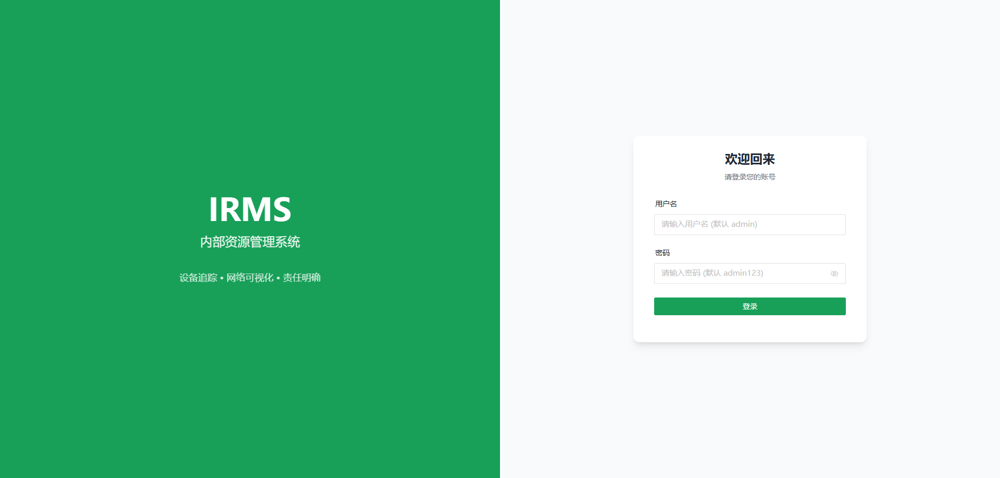
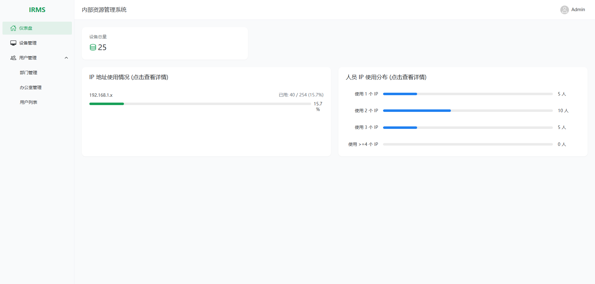
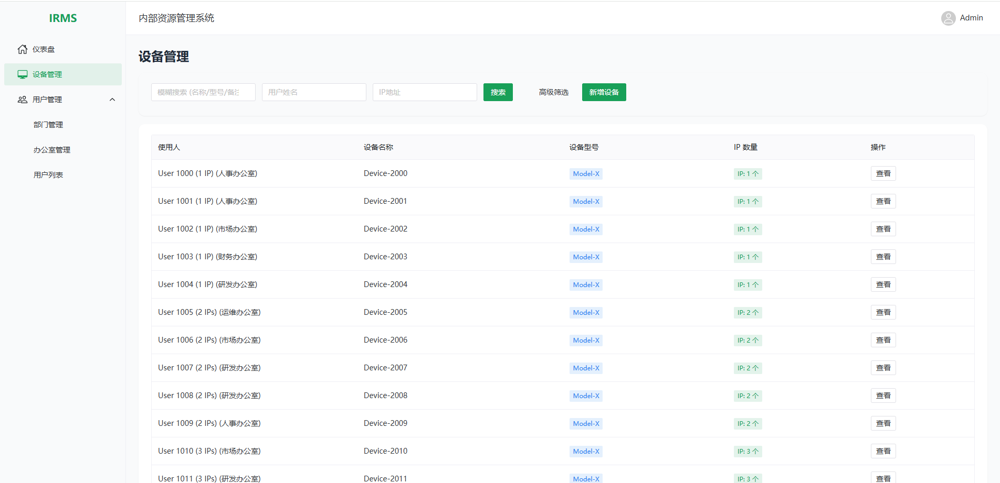
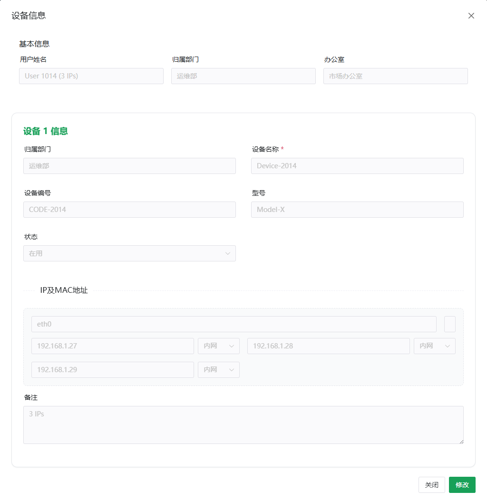

# IRMS - Internal Resource Management System (企业内部资源管理系统)

**IRMS** 是一款专为现代化企业打造的高效 IT 资源与资产管理平台。它基于 Spring Boot 3 与 Vue 3 技术栈，通过“以人为本”的管理理念，实现了从传统“设备清单”向“用户资产全生命周期”管理模式的进化。

---

## 🌟 核心功能特性 (Key Features)

### 1. 📊 智能资产驾驶舱 (Dashboard)
- **多维聚合分析**：直观展示企业内部 IP 资源的分布情况，包括单设备 IP 占用统计、网段使用率等。
- **交互式下钻 (Drill-down)**：图表与数据深度联动，点击统计维度即可精准跳转并过滤出对应的资产列表。

### 2. 👤 用户资产管理视图 (User-Centric Asset View)
- **行合并展示**：设备列表以用户为中心进行聚合，自动合并重复的人员、部门、办公室信息，清晰展示每个用户名下的所有 IT 资产。
- **批量资产维护**：支持在一个界面内为同一用户批量添加、修改或移除多台设备，极大提升了资产盘点与录入的效率。
- **查看/修改模式切换**：默认进入只读查看模式，防止误操作；点击“修改”后方可进行动态增减设备及配置。

### 3. 🛡️ 完善的生命周期管理 (Lifecycle Management)
- **“禁用”代替“删除”**：系统全面采用“状态管理”机制，通过“启用/禁用”控制记录可见性，确保资产历史数据可追溯，杜绝误删风险。
- **默认视图优化**：所有列表默认仅展示“正常”状态的数据，保持界面整洁高效。
- **全量过滤支持**：支持按“正常”、“停用”、“全部”维度进行快速筛选。

### 4. 💻 深度网络配置管理
- **灵活的网络模型**：单台设备支持绑定无限个 MAC 地址及对应的多个 IP 地址（内网/外网自动识别）。
- **可视化标签**：IP 及 MAC 地址采用高辨识度的绿色边框标签样式，配置信息一目了然。
- **高级检索**：支持双 IP 匹配、MAC 地址反查、IP 数量区间筛选等多种复杂查询场景。

### 5. 🏢 组织架构与办公室管理
| **数据持久化** | MyBatis-Plus | 高效 ORM 框架 |
| **安全鉴权** | Sa-Token + BCrypt | 轻量级权限管理与高强度加密 |
| **数据库** | MySQL 8.0 | 可靠的关系型存储 |

---

## 📸 系统截图 (System Screenshots)

<div align="center">
  
  
  
  
</div>

---

## 🚀 快速开始 (Quick Start)

### 1. 环境要求
- **Java**: JDK 17+
- **Node.js**: 18.0+
- **MySQL**: 8.0+
- **Maven**: 3.8+

### 2. 数据库准备
1. 创建数据库 `irms`：
   ```sql
   CREATE DATABASE IF NOT EXISTS irms
     DEFAULT CHARACTER SET utf8mb4
     DEFAULT COLLATE utf8mb4_general_ci;
   ```
2. 运行根目录下的 `irms.sql` 脚本初始化表结构与基础数据。

### 3. 启动项目
- **后端**：
  ```bash
  cd backend
  # 修改 application.yml 中的数据库配置
  mvn spring-boot:run
  ```
- **前端**：
  ```bash
  cd frontend
  npm install
  npm run dev
  ```
- **访问**：`http://localhost:5173`
- **默认登录**：用户 `admin`，密码 `123456`

---

## 📦 打包与部署

- **后端打包**：`mvn clean package -DskipTests` -> 产出 `target/*.jar`
- **前端打包**：`npm run build` -> 产出 `dist/` 目录
- **部署建议**：使用 Nginx 托管前端静态资源，并通过 `proxy_pass` 转发接口请求至后端服务。

---

## ⚠️ 常见问题 FAQ

**Q: 为什么在列表中找不到刚添加的设备？**
A: 请检查该设备所属的用户是否处于“正常”状态。系统默认仅显示启用状态的数据。

**Q: 如何为一个用户添加第二台电脑？**
A: 在设备管理页面点击该用户的“查看”，进入详情后点击右下角“修改”，然后点击设备列表右上角的“+”按钮即可添加新设备。

**Q: 登录密码忘记了怎么办？**
A: 请联系管理员在数据库 `sys_user` 表中重置密码字段。系统支持 BCrypt 密文或自动迁移旧版明文。